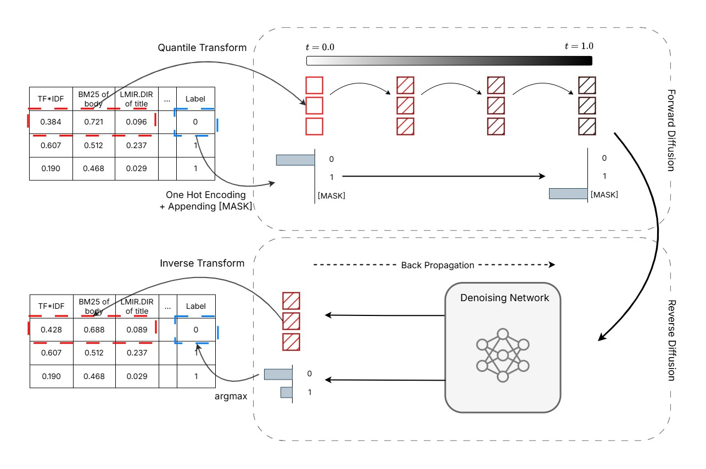

# DiffusionRank: Learning to Rank via Denoising Diffusion

<p align="center">
  <a href="https://arxiv.org/abs/2602.11453">
    
  </a>
  <a href="https://dl.acm.org/doi/10.1145/3805713.3820437">
    
  </a>
</p>

Official implementation of **DiffusionRank**, accepted at **ICTIR 2026** (*From Noise to Order: Learning to Rank via Denoising Diffusion*).


## Overview

DiffusionRank is a diffusion-based generative approach to Learning-to-Rank (LTR) that models the joint distribution over query-document features and relevance labels. It extends [TabDiff](https://github.com/MinkaiXu/TabDiff) to provide generative counterparts of classical **pointwise** and **pairwise** LTR objectives. At inference, relevance is predicted with a single reverse-diffusion step, keeping cost comparable to discriminative feedforward models.

### Key Features

- **Generative LTR**: Models the full joint distribution over features and relevance labels
- **Pointwise & Pairwise**: Supports both pointwise and pairwise training approaches
- **Efficient Inference**: Single-step denoising for relevance prediction, comparable to discriminative models
- **Flexible Architecture**: Uses feedforward networks with minimal parameter overhead





## Repository Structure

```
DiffusionRank/
├── generative/                        # DiffusionRank implementation
│   ├── main.py                        # Training and testing entry point
│   ├── tabdiff/                       # TabDiff-based diffusion modules
│   │   ├── models/                    # Diffusion model implementations
│   │   ├── modules/                   # Neural network modules
│   │   ├── trainer.py                 # Training logic
│   │   └── tabdiff_configs.toml       # Model configurations
│   └── synetune_launcher.py           # Hyperparameter tuning
├── discriminative/                    # Discriminative baseline models
│   ├── model.py                       # Neural network architecture
│   ├── pointwise.py                   # Pointwise discriminative model
│   ├── pairwise.py                    # Pairwise discriminative model (RankNet)
│   ├── pointwise_perturbed.py         # Pointwise with perturbed features
│   ├── pairwise_perturbed.py          # Pairwise with perturbed features
│   └── xgb.py                         # XGBoost baseline
├── EDA/                               # Exploratory data analysis
├── ltr_dataset_to_numpy.py            # Convert raw LTR data to numpy and create fraction subsets
├── compute_ranking_metrics.py         # Evaluation script
├── ndcg_significance_test.py          # Statistical significance testing
└── utils.py                           # Utility functions
```

## Installation

### Requirements

- Python 3.10+
- CUDA-capable GPU (recommended)

Install core dependencies:

```bash
pip install torch numpy scipy scikit-learn wandb xgboost tomli
```

## Data Preparation

### Downloading Datasets

Download Fold 1 splits and place them under `data/{dataset}/raw/Fold1/` as `train.txt`, `vali.txt`, and `test.txt`.

| Dataset | Source |
|---------|--------|
| MQ2007, MQ2008 | [LETOR 4.0](https://www.microsoft.com/en-us/research/project/letor-learning-rank-information-retrieval/letor-4-0/) |
| MSLR-WEB10K, MSLR-WEB30K | [MSLR benchmark](https://www.microsoft.com/en-us/research/project/mslr/) |
| Istella-S | [Istella LETOR](https://istella.ai/datasets/letor-dataset/) |

### Dataset Statistics (Fold 1)

| Dataset | Queries (Train / Val / Test) | Features | Labels |
|---------|------------------------------|----------|--------|
| MQ2007 | 1,017 / 339 / 336 | 46 | 3 (0–2) |
| MQ2008 | 471 / 157 / 156 | 46 | 3 (0–2) |
| MSLR-WEB10K | 6,000 / 2,000 / 2,000 | 136 | 5 (0–4) |
| MSLR-WEB30K | 18,919 / 6,306 / 6,306 | 136 | 5 (0–4) |
| Istella-S | 19,245 / 7,211 / 6,562 | 220 | 5 (0–4) |

### Convert to NumPy

The code has been designed to work with the datasets in the .npy format. To convert the datasets, run the following command. This script also creates fraction subsets of the datasets (k=1.0, 0.5, 0.25, 0.0625, 0.015625, 0.00390625) by query ID:

```bash
python ltr_dataset_to_numpy.py --dataset MQ2007 --fold 1
```

This writes fraction subsets to `data/{dataset}/by_fraction/Fold1/`:

```
data/
├── MQ2007/
│   └── by_fraction/
│       └── Fold1/
│           ├── k1.0/
│           │   ├── X_train.npy, y_train.npy, idx_train.npy
│           │   ├── X_train_non.npy, y_train_non.npy, idx_train_non.npy
│           │   ├── X_val.npy, y_val.npy, idx_val.npy
│           │   └── X_test.npy, y_test.npy, idx_test.npy
│           ├── k0.5/
│           ├── k0.25/
│           └── ...
└── ...
```

## Training

### Recommended Hyperparameters

| Setting | MQ2007 / MQ2008 | MSLR-WEB10K / WEB30K / Istella-S |
|---------|-----------------|----------------------------------|
| Hidden dim (`--dim_t` / `--num_hidden_nodes`) | 256 | 1024 |
| Training steps (`--steps`) | 15,000 | 10,000 |
| Learning rate | 5e-6 | 5e-6 |
| Batch size | 4096 | 4096 |

Add `--non_learnable_schedule` to DiffusionRank runs to match the fixed noise schedule used in the paper experiments.

### DiffusionRank (Generative)

Run from `generative/`:

#### Pointwise

```bash
cd generative
python main.py \
    --dataname MQ2007 \
    --approach pointwise \
    --mode train \
    --non_learnable_schedule \
    --steps 15000 \
    --lr 5e-6 \
    --batch_size 4096 \
    --dim_t 256 \
    --num_layers 4 \
    --device cuda:0
```

#### Pairwise

```bash
cd generative
python main.py \
    --dataname MQ2007 \
    --approach pairwise \
    --mode train \
    --non_learnable_schedule \
    --steps 15000 \
    --lr 5e-6 \
    --batch_size 4096 \
    --dim_t 256 \
    --num_layers 4 \
    --device cuda:0
```

#### Training with Data Fractions

Use the `--k` parameter to train with a subset of data:

```bash
cd generative
python main.py \
    --dataname MSLR-WEB10K \
    --approach pointwise \
    --mode train \
    --non_learnable_schedule \
    --dim_t 1024 \
    --steps 10000 \
    --k 0.25 \
    --device cuda:0
```

Checkpoints are saved under `generative/checkpoints/{dataset}/{exp_name}/`.

### Discriminative Baselines

Run from `discriminative/`:

#### Pointwise

```bash
cd discriminative
python pointwise.py \
    --dataset MQ2007 \
    --task train \
    --num_hidden_nodes 256 \
    --lr 5e-6 \
    --k 1.0 \
    --device cuda:0
```

#### Pairwise (RankNet)

```bash
cd discriminative
python pairwise.py \
    --dataset MQ2007 \
    --task train \
    --num_hidden_nodes 256 \
    --lr 5e-6 \
    --k 1.0 \
    --device cuda:0
```

#### Perturbed-Feature Baselines

For the robustness experiments in the paper:

```bash
cd discriminative
python pointwise_perturbed.py --dataset MQ2007 --task train --num_hidden_nodes 256 --k 1.0
python pairwise_perturbed.py --dataset MQ2007 --task train --num_hidden_nodes 256 --k 1.0
```

### XGBoost Baseline

```bash
cd discriminative
python xgb.py \
    --dataset MQ2007 \
    --approach pointwise \
    --k 1.0
```

## Testing & Evaluation

### Testing DiffusionRank

```bash
cd generative
python main.py \
    --dataname MQ2007 \
    --approach pointwise \
    --mode test \
    --non_learnable_schedule \
    --ckpt_path checkpoints/MQ2007/your_experiment/best_model.pt \
    --device cuda:0
```

If `--ckpt_path` is omitted, the best checkpoint under `checkpoints/{dataset}/{exp_name}/` is used automatically.

### Computing Ranking Metrics

Evaluate predictions using NDCG@10 and MAP@10:

```bash
python compute_ranking_metrics.py --run_file predictions/your_predictions.txt
```

## Key Arguments

### Generative Model (`generative/main.py`)

| Argument | Description | Default |
|----------|-------------|---------|
| `--dataname` | Dataset (MQ2007, MQ2008, MSLR-WEB10K, MSLR-WEB30K, Istella-S) | - |
| `--approach` | Training approach (`pointwise`, `pairwise`) | `pointwise` |
| `--mode` | `train` or `test` | `train` |
| `--steps` | Training steps | 15000 |
| `--lr` | Learning rate | 5e-6 |
| `--batch_size` | Batch size | 4096 |
| `--dim_t` | Hidden dimension | 256 |
| `--num_layers` | Number of hidden layers | 4 |
| `--k` | Fraction of training queries to use | 1.0 |
| `--device` | Device (`cuda:0`, `cpu`, …) | `cuda:0` |
| `--non_learnable_schedule` | Use fixed (non-learnable) noise schedule | off |
| `--exp_name` | Experiment name for checkpoints / W&B | auto |
| `--ckpt_path` | Checkpoint path (testing / finetuning) | auto |
| `--no_wandb` | Disable Weights & Biases logging | False |

### Discriminative Models

| Argument | Description | Default |
|----------|-------------|---------|
| `--dataset` | Dataset name | - |
| `--task` | `train` or `test` | - |
| `--num_hidden_nodes` | Hidden layer size | - |
| `--lr` | Learning rate | 5e-6 |
| `--k` | Fraction of training data | 1.0 |
| `--device` | Device | `cuda:0` |
| `--checkpoint` | Path to model checkpoint (for testing) | None |
| `--no_wandb` | Disable Weights & Biases logging | False |

## Model Architecture Comparison

DiffusionRank extends the discriminative model architecture by:

1. **Input**: Adding the (possibly masked) relevance label and diffusion time step as additional inputs
2. **Output**: Jointly predicting the relevance label and the noise added to features


## Results

DiffusionRank consistently improves over discriminative neural baselines on MQ2007, MSLR-WEB10K, and MSLR-WEB30K in both pointwise and pairwise settings, with additional gains on Istella-S in the pointwise setting. Improvements hold across multiple training-data fractions and remain statistically significant against perturbed-feature discriminative baselines. See the paper for full tables and analysis.


## Citation

If you use this code or build on DiffusionRank, please cite:

```bibtex
@article{ebrahimi2026noise,
  title={From Noise to Order: Learning to Rank via Denoising Diffusion},
  author={Ebrahimi, Sajad and Mitra, Bhaskar and Arabzadeh, Negar and Yuan, Ye and Wu, Haolun and Zarrinkalam, Fattane and Bagheri, Ebrahim},
  journal={arXiv preprint arXiv:2602.11453},
  year={2026}
}
```


## Acknowledgements

This work builds upon [TabDiff](https://github.com/MinkaiXu/TabDiff), a mixed-type diffusion model for tabular data generation.